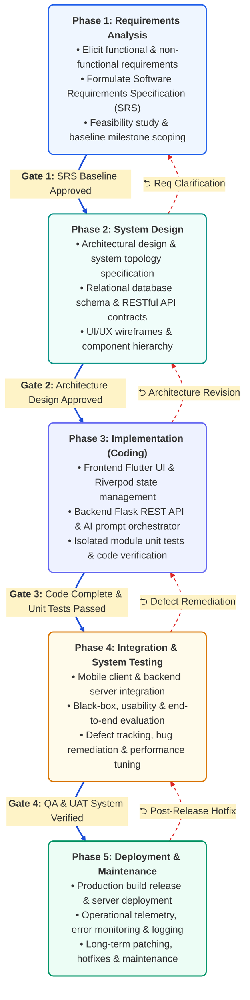
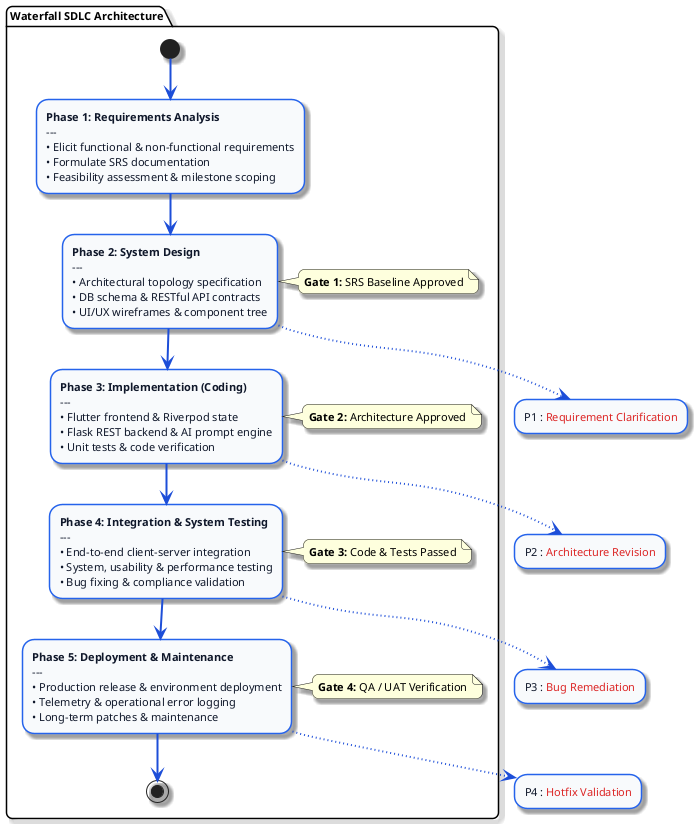

# Figure 3.1.1: Waterfall SDLC Model Architecture - Design & Diagram Prompts

This document provides multi-format diagram specifications (Mermaid, PlantUML, Draw.io / SVG prompts, LaTeX TikZ, and AI Visual Prompts) to generate **Figure 3.1.1: Waterfall SDLC Model Architecture** for your Final Year Project (FYP) report.

---

## 1. Professional Mermaid.js Code
> *You can paste this directly into [Mermaid Live Editor (mermaid.live)](https://mermaid.live), GitHub, Notion, or Obsidian.*



---

## 2. PlantUML Architecture Code
> *Paste into [PlantText (planttext.com)](https://www.planttext.com/) or IntelliJ / VS Code PlantUML plugin.*



---

## 3. Structured Prompt for AI Diagram Generators
*(Copy-paste this prompt into Eraser.io, Napkin AI, Claude, ChatGPT Plus, Midjourney, or DALL-E 3)*

```text
Generate a clean, modern, publication-ready academic software engineering diagram titled "Figure 3.1.1: Waterfall SDLC Model Architecture" for a computer science university thesis.

Layout Requirements:
- A clean diagonal stepped staircase layout (from top-left to bottom-right) containing exactly 5 sequential stages.
- Each stage is rendered in a modern rounded card with a distinct dark header band, subtle drop shadow, and clean bulleted text.

The 5 Phases & Content:
1. [Phase 1: Requirements Analysis] (Theme: Royal Blue)
   - Elicit functional & non-functional requirements
   - Formulate Software Requirements Specification (SRS)
   - Feasibility assessment & milestone scoping
2. [Phase 2: System Design] (Theme: Ocean Teal)
   - Architectural design & system topology specification
   - Relational database schema & RESTful API contracts
   - UI/UX wireframes & component hierarchy
3. [Phase 3: Implementation (Coding)] (Theme: Indigo)
   - Frontend Flutter UI & Riverpod state management
   - Backend Flask REST API & AI prompt orchestrator
   - Module-level unit tests & code verification
4. [Phase 4: Integration & System Testing] (Theme: Amber Brown)
   - Subsystem integration (Mobile Client + Backend Server)
   - Functional, usability & end-to-end system testing
   - Defect logging, bug remediation & performance tuning
5. [Phase 5: Deployment & Maintenance] (Theme: Emerald Green)
   - Production environment deployment & client release
   - Operational telemetry, error monitoring & logging
   - Long-term patching, hotfixes & maintenance

Connector Lines:
- Forward Flow: Crisp bold blue cascading arrows stepping from the bottom of Phase N to the top of Phase N+1.
- Gate Check Badges: Clean badge pills above each transition labeled "Gate 1: SRS Approved", "Gate 2: Architecture Approved", "Gate 3: Code Complete", "Gate 4: QA Verified".
- Feedback Loops: Subtle red dashed curved return arcs on the left side indicating upstream defect feedback loops ("Requirement Clarification", "Design Revision", "Bug Remediation").

Aesthetic Style: Minimalist, crisp vector graphics, high contrast, clean sans-serif typography, pure white background, professional academic look.
```

---

## 4. LaTeX TikZ Code (For Overleaf / LaTeX Thesis)

```latex
\documentclass[border=10pt]{standalone}
\usepackage{tikz}
\usetikzlibrary{shapes.multipart, positioning, arrows.meta, calc, fit}

\begin{document}
\begin{tikzpicture}[
    phase/.style={
        rectangle split,
        rectangle split parts=2,
        rectangle split part fill={#1!90!black, #1!8!white},
        rounded corners=4pt,
        draw=#1!80!black,
        line width=1.2pt,
        text width=6.2cm,
        minimum height=2.0cm,
        inner sep=6pt,
        font=\sffamily\footnotesize
    },
    downlink/.style={-{Stealth[scale=1.2]}, line width=1.8pt, draw=blue!70!black},
    feedback/.style={-{Stealth[scale=1.0]}, dashed, line width=1.0pt, draw=red!70!black}
]

% Nodes
\node[phase=blue] (p1) at (0, 8.0) {
    \textbf{\textcolor{white}{Phase 1: Requirements Analysis}}
    \nodepart{two}
    $\bullet$ Elicit functional \& non-functional specs\\
    $\bullet$ Formulate SRS document\\
    $\bullet$ Feasibility assessment \& scope baseline
};

\node[phase=teal] (p2) at (3.2, 5.8) {
    \textbf{\textcolor{white}{Phase 2: System Design}}
    \nodepart{two}
    $\bullet$ Architectural topology specification\\
    $\bullet$ Relational DB schema \& API contracts\\
    $\bullet$ UI/UX wireframes \& component hierarchy
};

\node[phase=indigo] (p3) at (6.4, 3.6) {
    \textbf{\textcolor{white}{Phase 3: Implementation (Coding)}}
    \nodepart{two}
    $\bullet$ Flutter frontend UI \& Riverpod state\\
    $\bullet$ Flask REST API \& AI prompt orchestrator\\
    $\bullet$ Unit tests \& code verification
};

\node[phase=orange] (p4) at (9.6, 1.4) {
    \textbf{\textcolor{white}{Phase 4: Integration \& Testing}}
    \nodepart{two}
    $\bullet$ Mobile client \& backend integration\\
    $\bullet$ System, usability \& evaluation testing\\
    $\bullet$ Defect tracking \& bug remediation
};

\node[phase=green] (p5) at (12.8, -0.8) {
    \textbf{\textcolor{white}{Phase 5: Deployment \& Maintenance}}
    \nodepart{two}
    $\bullet$ Production deployment \& client release\\
    $\bullet$ Operational telemetry \& error logging\\
    $\bullet$ Long-term patches \& maintenance
};

% Downward Arrows with Gate Badges
\draw[downlink] (p1.south) |- (p2.north west) node[pos=0.5, above=2pt, font=\sffamily\tiny\bfseries, color=blue!80!black, fill=blue!5, rounded corners=2pt, draw=blue!30] {Gate 1: SRS Approved};
\draw[downlink] (p2.south) |- (p3.north west) node[pos=0.5, above=2pt, font=\sffamily\tiny\bfseries, color=blue!80!black, fill=blue!5, rounded corners=2pt, draw=blue!30] {Gate 2: Design Approved};
\draw[downlink] (p3.south) |- (p4.north west) node[pos=0.5, above=2pt, font=\sffamily\tiny\bfseries, color=blue!80!black, fill=blue!5, rounded corners=2pt, draw=blue!30] {Gate 3: Code Complete};
\draw[downlink] (p4.south) |- (p5.north west) node[pos=0.5, above=2pt, font=\sffamily\tiny\bfseries, color=blue!80!black, fill=blue!5, rounded corners=2pt, draw=blue!30] {Gate 4: QA Verified};

% Upstream Feedback Loops
\draw[feedback] (p2.west) to[bend left=45] node[left, font=\sffamily\tiny\itshape, color=red!70!black] {Req Clarification} (p1.west);
\draw[feedback] (p3.west) to[bend left=45] node[left, font=\sffamily\tiny\itshape, color=red!70!black] {Design Revision} (p2.west);
\draw[feedback] (p4.west) to[bend left=45] node[left, font=\sffamily\tiny\itshape, color=red!70!black] {Bug Remediation} (p3.west);
\draw[feedback] (p5.west) to[bend left=45] node[left, font=\sffamily\tiny\itshape, color=red!70!black] {Hotfix Validation} (p4.west);

\end{tikzpicture}
\end{document}
```

---

## 5. Formal Thesis Caption & Description

**Figure 3.1.1: Waterfall SDLC Model Architecture**  
*Figure 3.1.1 illustrates the classical sequential Waterfall SDLC architecture executed in strict chronological order across five discrete phases: Requirements Analysis, System Design, Implementation (Coding), Integration & System Testing, and Deployment & Maintenance. Each phase is governed by formal stage-gate approval criteria (Gates 1 through 4) preventing downstream advancement until prerequisite documentation and testing baselines are fully validated. Upstream feedback loops allow controlled defect remediation and requirements clarification.*
