# Figure 3.1.2: Agile Scrum Iterative Development Cycle - Design & Diagram Prompts

This document provides multi-format diagram specifications (Mermaid, AI Visual Prompts, PlantUML, LaTeX TikZ, and Thesis Report Captions) to generate **Figure 3.1.2: Agile Scrum Iterative Development Cycle** for your Final Year Project (FYP) report.

---

## 1. AI Visual Generation Prompt
*(Copy-paste this directly into **Eraser.io**, **Napkin AI**, **Claude Artifacts**, **ChatGPT Plus**, **Midjourney v6**, or **DALL-E 3**)*

```text
Generate a clean, modern, publication-ready academic software engineering diagram titled "Figure 3.1.2: Agile Scrum Iterative Development Cycle" for a computer science university thesis.

Layout & Flow:
A continuous cyclical Scrum framework layout structured from left to right:
1. [Product Backlog] (Leftmost pillar / backlog container)
   - Prioritized user stories, features, bug fixes & system enhancements.
   - Managed continuously by Product Owner & stakeholders.
2. [Sprint Planning & Sprint Backlog] (Transition gateway)
   - Sprint Goal formulation, effort estimation (Story Points).
   - Selected subset committed to the 1-to-3 week Sprint Backlog.
3. [Sprint Execution Cycle] (Central circular / looping hub, duration: 1-3 Weeks)
   - Daily Standup (24-hour micro-cycle: Yesterday, Today, Blockers).
   - Core activities: Development, Pair Programming, Continuous Integration (CI), Daily Testing.
4. [Potentially Shippable Product Increment] (Output deliverable)
   - Working, tested, and integrated software build meeting the "Definition of Done" (DoD).
5. [Sprint Review & Sprint Retrospective] (Feedback loop back to Product Backlog)
   - Sprint Review: Live demo to stakeholders & feedback gathering.
   - Sprint Retrospective: Process introspection & continuous team improvement.
   - Curved feedback arrow routing lessons and new user stories back into the Product Backlog.

Aesthetic & Color Palette:
- Background: Pure white (#FFFFFF)
- Product Backlog: Slate Navy Blue (#1E3A8A / #EFF6FF)
- Sprint Planning: Teal (#0D9488 / #F0FDFA)
- Sprint Core Loop: Vibrant Indigo / Violet (#4F46E5 / #EEF2FF)
- Shippable Increment: Emerald Green (#059669 / #ECFDF5)
- Review & Retrospective: Amber Orange (#D97706 / #FFFBEB)
- Typography: Clean sans-serif (Inter / Arial), crisp vector styling, professional academic publication quality.
```

---

## 2. Professional Mermaid.js Code
> *Paste directly into [Mermaid Live Editor (mermaid.live)](https://mermaid.live), GitHub, Notion, or Obsidian.*

```mermaid
%%{init: {'theme': 'base', 'themeVariables': { 'fontFamily': 'Arial, sans-serif', 'primaryColor': '#EFF6FF', 'primaryBorderColor': '#2563EB', 'lineColor': '#1D4ED8' }}}%%
graph LR
    %% Backlog & Inputs
    subgraph Inputs ["1. Requirements & Scoping"]
        PB["<b>Product Backlog</b><br/>• Prioritized User Stories<br/>• Feature Requests<br/>• Non-functional Specs<br/>• Bug Fixes & Tech Debt"]
    end

    %% Planning & Sprint Backlog
    subgraph Planning ["2. Sprint Commitment"]
        SP["<b>Sprint Planning</b><br/>• Sprint Goal Definition<br/>• Story Point Estimation"]
        SB["<b>Sprint Backlog</b><br/>• Committed Task List<br/>• 1 - 3 Week Scope"]
    end

    %% Central Sprint Execution
    subgraph Execution ["3. Sprint Execution (1-3 Weeks)"]
        SC["<b>Sprint Execution Cycle</b><br/>• Flutter UI & Flask Coding<br/>• Continuous Integration (CI)<br/>• Unit & Integration Testing"]
        DS["<b>Daily Standup (24h)</b><br/>• Completed yesterday<br/>• Target today<br/>• Impediments / Blockers"]
    end

    %% Output & Inspection
    subgraph Output ["4. Increment & Inspection"]
        PI["<b>Potentially Shippable<br/>Product Increment</b><br/>• Meets 'Definition of Done'<br/>• Deployed staging build"]
        SR["<b>Sprint Review</b><br/>• Live Stakeholder Demo<br/>• User Feedback Intake"]
        ST["<b>Sprint Retrospective</b><br/>• Process Improvement<br/>• Actionable Team Insights"]
    end

    %% Connections
    PB -->|Sprint Selection| SP
    SP -->|Scope Freeze| SB
    SB -->|Execution Start| SC
    SC <-->|Daily Sync| DS
    SC -->|Sprint Completion| PI
    PI -->|Demo & Evaluation| SR
    SR -->|Team Introspection| ST
    ST -.->|Adapted User Stories & Process Lessons| PB

    %% Styling
    style PB fill:#EFF6FF,stroke:#2563EB,stroke-width:2px,rx:6px,ry:6px
    style SP fill:#F0FDFA,stroke:#0D9488,stroke-width:2px,rx:6px,ry:6px
    style SB fill:#F0FDFA,stroke:#0D9488,stroke-width:2px,rx:6px,ry:6px
    style SC fill:#EEF2FF,stroke:#4F46E5,stroke-width:2.5px,rx:8px,ry:8px
    style DS fill:#FDF4FF,stroke:#A855F7,stroke-width:1.5px,rx:6px,ry:6px
    style PI fill:#ECFDF5,stroke:#059669,stroke-width:2.5px,rx:8px,ry:8px
    style SR fill:#FFFBEB,stroke:#D97706,stroke-width:2px,rx:6px,ry:6px
    style ST fill:#FFFBEB,stroke:#D97706,stroke-width:2px,rx:6px,ry:6px
    linkStyle 0,1,2,4,5,6 stroke:#1D4ED8,stroke-width:2px
    linkStyle 3 stroke:#9333EA,stroke-width:1.8px
    linkStyle 7 stroke:#DC2626,stroke-width:1.8px,stroke-dasharray: 5 5
```



---

## 3. PlantUML Architecture Code
> *Paste into [PlantText (planttext.com)](https://www.planttext.com/)*

```plantuml
@startuml
skinparam backgroundColor #FFFFFF
skinparam shadowing true
skinparam roundCorner 10
skinparam defaultFontName Arial
skinparam defaultFontSize 11

skinparam state {
  BackgroundColor #F8FAFC
  BorderColor #2563EB
  FontColor #0F172A
}

title Figure 3.1.2: Agile Scrum Iterative Development Cycle

state "<b>1. Product Backlog</b>\n---\n• Ranked User Stories\n• Feature Backlog\n• Technical Debt" as PB #EFF6FF
state "<b>2. Sprint Planning</b>\n---\n• Define Sprint Goal\n• Estimate Effort" as SP #F0FDFA
state "<b>3. Sprint Backlog</b>\n---\n• Committed Tasks\n• 1-3 Week Scope" as SB #F0FDFA

state "<b>4. Sprint Execution (1-3 Weeks)</b>" as SE #EEF2FF {
  state "Daily Standup (24h Sync)" as DS #FDF4FF
  state "Development & CI/CD" as DEV #EEF2FF
  DEV <--> DS : Daily Check-in
}

state "<b>5. Shippable Increment</b>\n---\n• Working Software\n• Tested & Verified" as INC #ECFDF5
state "<b>6. Sprint Review & Demo</b>\n---\n• Stakeholder Feedback" as SR #FFFBEB
state "<b>7. Sprint Retrospective</b>\n---\n• Process Improvement" as RETRO #FFFBEB

[*] --> PB
PB --> SP : Selection
SP --> SB : Commitment
SB --> SE : Sprint Launch
SE --> INC : Done Increment
INC --> SR : Demonstration
SR --> RETRO : Reflection
RETRO ..> PB : <color:#DC2626>Backlog Adaptation & Next Sprint</color>
@enduml
```

---

## 4. Formal Thesis Caption & Description

**Figure 3.1.2: Agile Scrum Iterative Development Cycle**  
*Figure 3.1.2 illustrates the time-boxed Agile Scrum methodology. Requirements are managed dynamically via a prioritized Product Backlog. Development is executed in iterative Sprints (typically 1 to 3 weeks), starting with Sprint Planning and Sprint Backlog commitment. During sprint execution, 24-hour Daily Standups ensure continuous team alignment and blocker resolution. Each sprint yields a Potentially Shippable Product Increment evaluated during the Sprint Review, followed by a Sprint Retrospective to continuously feed lessons and refined stories back into the Product Backlog.*
