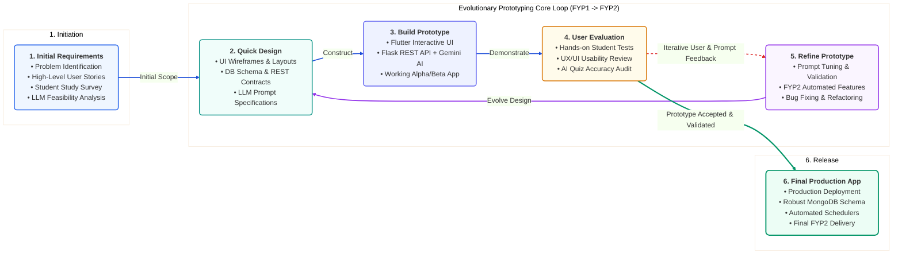

# Figure 3.1.3: Evolutionary Prototyping Development Methodology - Design & Diagram Prompts

This document provides multi-format diagram specifications (Mermaid, AI Visual Prompts, PlantUML, and Thesis Justification Text) to generate **Figure 3.1.3: Evolutionary Prototyping Development Methodology** for your Final Year Project (FYP) report (Selected SDLC Methodology).

---

## 1. AI Visual Generation Prompt
*(Copy-paste directly into **Eraser.io**, **Napkin AI**, **Claude Artifacts**, **ChatGPT Plus**, **Midjourney v6**, or **DALL-E 3**)*

```text
Generate a clean, modern, publication-ready academic software engineering architecture diagram titled "Figure 3.1.3: Evolutionary Prototyping Development Methodology" for a computer science university thesis.

Layout & Structure:
1. [Initial Requirements Gathering] (Leftmost standalone container - Royal Blue)
   - Problem Identification, High-Level User Stories, Student Study Pain-Point Survey, LLM Feasibility Analysis.
   - Solid blue arrow pointing into the central prototyping engine labeled "Initial Scope".

2. [Evolutionary Prototyping Iterative Engine] (Central large dashed container)
   Comprising a 4-step circular feedback loop:
   - [Step 2: Quick Design] (Top-Left, Ocean Teal): UI Wireframes, DB Schema, REST API contracts, Gemini Prompt specs.
   - [Step 3: Build Prototype] (Top-Right, Indigo): Flutter interactive code, Flask REST backend, executable alpha/beta build.
   - [Step 4: User Evaluation] (Bottom-Right, Warm Amber): Hands-on undergraduate testing, UI usability review, AI accuracy evaluation.
   - [Step 5: Refine Prototype] (Bottom-Left, Purple): Gemini prompt tuning, adding FYP2 automated features, bug remediation.
   
   Loop Connectors:
   - Quick Design -> Build Prototype (Blue arrow: "Construct")
   - Build Prototype -> User Evaluation (Blue arrow: "Demonstrate to Students")
   - User Evaluation -> Refine Prototype (Red dashed arrow: "Iterative Feedback Loop: Unmet Requirements & Prompt Tuning")
   - Refine Prototype -> Quick Design (Purple arrow: "Evolve Design & Architecture")

3. [Final Production System] (Rightmost deliverable container - Emerald Green)
   - Production Deployment, Fully Validated Feature Set, Robust MongoDB Schemas, Automated Background Schedulers, Final FYP2 Thesis Delivery.
   - Solid green exit arrow from Step 4 (User Evaluation) to Step 6 labeled "Prototype Accepted & Requirements Stable".

4. [Bottom Summary Banner]
   - Highlights why this model is selected: (1) Generative AI & Prompt Tuning, (2) Exploratory Interactive UI (Mind Maps, 3D Flashcards, Live Multiplayer), (3) Organic FYP1 to FYP2 Architectural Evolution.

Aesthetic Style: Crisp minimalist cards with subtle shadows, rounded borders, pure white background (#FFFFFF), high contrast, clean sans-serif typography, publication quality.
```

---

## 2. Professional Mermaid.js Code
> *Paste directly into [Mermaid Live Editor (mermaid.live)](https://mermaid.live), GitHub, Notion, or Obsidian.*



---

## 3. PlantUML Code
> *Paste into [PlantText (planttext.com)](https://www.planttext.com/)*

```plantuml
@startuml
skinparam backgroundColor #FFFFFF
skinparam shadowing true
skinparam roundCorner 10
skinparam defaultFontName Arial
skinparam defaultFontSize 11

title Figure 3.1.3: Evolutionary Prototyping Development Methodology

state "<b>1. Initial Requirements Gathering</b>\n---\n• Problem Identification\n• High-Level User Stories\n• LLM Feasibility Analysis" as P1 #EFF6FF

state "<b>Evolutionary Prototyping Iterative Engine (FYP1 -> FYP2)</b>" as Core #F8FAFC {
  state "<b>2. Quick Design</b>\n---\n• UI Wireframes & Layouts\n• DB Schema & REST Contracts\n• LLM Prompt Specifications" as P2 #F0FDFA
  state "<b>3. Build Prototype</b>\n---\n• Flutter Interactive UI\n• Flask REST API + Gemini AI\n• Executable Alpha/Beta Build" as P3 #EEF2FF
  state "<b>4. User Evaluation</b>\n---\n• Hands-on Student Tests\n• UX/UI Usability Review\n• AI Quiz Accuracy Audit" as P4 #FFFBEB
  state "<b>5. Refine Prototype</b>\n---\n• Prompt Tuning & Validation\n• Add FYP2 Automated Features\n• Bug Fixing & Refactoring" as P5 #FAF5FF

  P2 --> P3 : Construct
  P3 --> P4 : Demonstrate to Users
  P4 ..> P5 : <color:#DC2626><b>Iterative Feedback Loop</b>\n(Unmet Needs & AI Prompt Tuning)</color>
  P5 --> P2 : Evolve Design & Architecture
}

state "<b>6. Final Production Application</b>\n---\n• Production Deployment\n• Robust MongoDB & Schedulers\n• User Acceptance Verified\n• Final FYP2 Thesis Delivery" as P6 #ECFDF5

[*] --> P1
P1 --> P2 : Initial Scope Baseline
P4 --> P6 : <color:#059669><b>✓ Prototype Accepted & Requirements Stable</b></color>
P6 --> [*]
@enduml
```

---

## 4. Formal Thesis Report Section Context & Caption (Chapter 3)

### Caption:
> **Figure 3.1.3: Evolutionary Prototyping Development Methodology**  
> *Figure 3.1.3 illustrates the Evolutionary Prototyping lifecycle selected as the core SDLC methodology for Note2Quiz. Development begins with preliminary requirement gathering, followed by an iterative four-step refinement engine (Quick Design, Prototype Construction, User Evaluation, and Prototype Refinement). The operational prototype undergoes rapid weekly usability testing and continuous Generative AI prompt optimization until stakeholders and test users validate feature completeness, transitioning the stable prototype into the final engineered production system.*

### Thesis Justification Points (Section 3.1.4):
1. **Generative AI & Prompt Engineering**: LLM question generation fidelity required empirical prompt tuning and JSON schema validation against diverse lecture formats.
2. **Exploratory UI & Gestural Interactions**: Interactive Mind Maps, 3D Flashcard animations, and Live Multiplayer Kahoot-style quiz rooms required iterative user feedback.
3. **Organic FYP1 to FYP2 Architectural Expansion**: Enabled incremental progression from FYP1 core baseline to FYP2 automated schedules, forgetting-curve decay models, and mistake banks.
