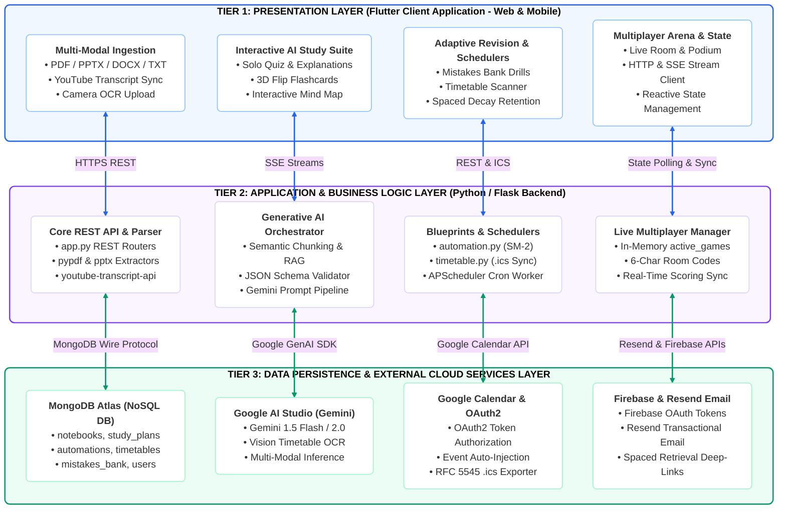
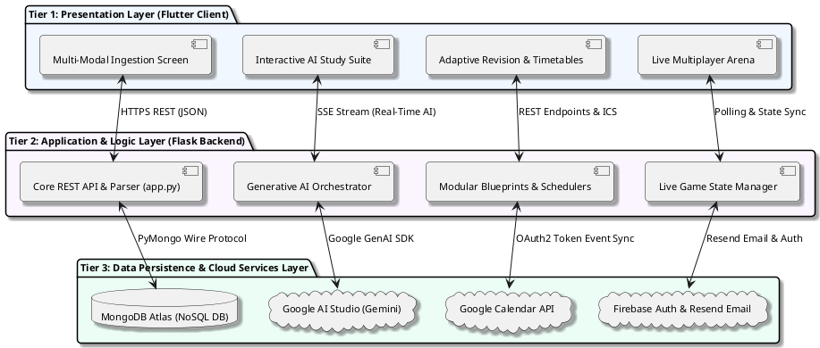

# Figure 4.1.1: High-Level 3-Tier System Architecture of Note2Quiz - Design & Diagram Prompts

This document provides multi-format diagram specifications (AI Visual Prompts, Mermaid.js, PlantUML, and Formal Thesis Captions) to generate **Figure 4.1.1: High-Level 3-Tier System Architecture of Note2Quiz** for Chapter 4 (System Design) of your Final Year Project (FYP2) report.

---

## 1. Content-Focused AI Generation Prompt (Unconstrained & Creative)
*(Feed this directly into **Napkin AI**, **Eraser.io**, **Whimsical AI**, **Claude Artifacts**, **ChatGPT Plus**, **Miro AI**, or **Midjourney** to let their layout engines produce optimal, compact, and aesthetic 3-tier architecture visuals without awkward whitespace)*

```text
Create a high-resolution, modern academic 3-Tier system architecture diagram for a university computer science thesis.

Title: Figure 4.1.1: High-Level 3-Tier System Architecture of Note2Quiz
System: Note2Quiz Intelligent Platform (AI-Powered Active Recall & Automated Study Assistant)

Please design a clean, balanced, visually compact 3-tier architecture diagram showing the layered flow and communication between Presentation, Application Logic, and Data/Cloud Services:

Tier 1: Presentation Layer (Client Application - Cross-Platform Flutter Mobile & Web)
• Multi-Modal Ingestion View: PDF/PPTX/DOCX/TXT upload, YouTube transcript sync, camera OCR
• Interactive AI Study Suite: Solo quiz engine with deep explanations, 3D flip flashcards, interactive mind map explorer
• Adaptive Revision & Schedulers: Mistakes bank & remedial drills, timetable scanner, spaced decay retention tracker
• Multiplayer Arena & State: Live Kahoot-style room & podium, HTTP/SSE stream clients, reactive state management

[Communication Protocol: HTTPS REST (JSON Payloads), Server-Sent Events (SSE AI Streams), State Polling]

Tier 2: Application & Business Logic Layer (Python / Flask Backend & Workers)
• Core REST API & Parsers: app.py routing engine, pypdf & python-pptx extractors, youtube-transcript-api
• Generative AI Orchestrator: Semantic RAG chunking, structured JSON schema validation, Gemini Flash prompt pipeline
• Modular Blueprints & Schedulers: blueprints/automation.py (SM-2 decay), blueprints/timetable.py (.ics sync), APScheduler cron daemon worker
• Live Multiplayer & Sync Manager: In-memory active_games state, 6-character room codes, real-time podium scoring & sync

[Communication Protocol: MongoDB Wire Protocol (PyMongo), Google GenAI SDK (gRPC/HTTPS), Google API OAuth2, Resend REST API]

Tier 3: Data Persistence & External Cloud Services Layer
• Database: MongoDB Atlas (collections: notebooks, study_plans, automations, timetables, mistakes_bank, users)
• AI Inference: Google AI Studio (Gemini 1.5 Flash / 2.0 API, Vision timetable OCR, multimodal prompt processing)
• Calendar & Schedule: Google Calendar API (OAuth2 semester event sync) & RFC 5545 .ics export
• Identity & Alerts: Firebase Authentication (OAuth identity tokens) & Resend API (transactional spaced retrieval emails)

Design Preferences:
- Modern, clean, balanced proportions with zero excessive whitespace.
- 3 distinct cohesive color-coded tiers (e.g. Blue for Client, Purple for Backend, Green for Data/Cloud).
- Bidirectional communication arrows with clear protocol badges.
- Professional typography, high readability, publication quality.
```

---

## 2. Rigid Structural AI Visual Generation Prompt
*(Copy-paste this directly into **Eraser.io**, **Napkin AI**, **Claude Artifacts**, **ChatGPT Plus**, **Midjourney v6**, or **DALL-E 3**)*

```text
Generate a clean, modern, publication-ready academic software architecture diagram titled "Figure 4.1.1: High-Level 3-Tier System Architecture of Note2Quiz" for a computer science university thesis.

Layout & Structure (Top to Bottom, 3 Layered Tiers):

[TIER 1: PRESENTATION LAYER (CLIENT)] (Top Tier, Primary Blue Theme #1E3A8A / #F0F7FF)
- Header: "TIER 1: PRESENTATION LAYER (Flutter Client Application - Web & Mobile Cross-Platform)"
- 4 Internal Subsystem Cards:
  1. "Multi-Modal Ingestion View": PDF, PPTX, DOCX, TXT document upload, YouTube transcript sync, image OCR camera hub.
  2. "Interactive AI Study Suite": Solo quiz engine with deep explanations, 3D flip flashcard review deck, interactive mind map visualizer.
  3. "Adaptive Revision & Schedulers": Mistakes bank & remedial drills, timetable syllabus scanner, spaced decay retention tracker.
  4. "Multiplayer Arena & State": Live Kahoot-style room & podium leaderboard, HTTP REST & SSE stream clients, reactive state & theme engine.

[INTER-TIER PROTOCOL BUS (Tier 1 <-> Tier 2)]
- 4 bidirectional vertical arrows connecting Tier 1 to Tier 2 with labeled protocol pills:
  - "HTTPS REST (JSON Payloads)"
  - "SSE Streams (Real-Time AI Streaming)"
  - "REST Endpoints & ICS Download"
  - "Polling & State Sync Stream"

[TIER 2: APPLICATION & BUSINESS LOGIC LAYER (BACKEND)] (Middle Tier, Royal Purple Theme #5B21B6 / #FAF5FF)
- Header: "TIER 2: APPLICATION & BUSINESS LOGIC LAYER (Python / Flask Micro-framework & Background Workers)"
- 4 Internal Subsystem Cards:
  1. "Core REST API & Multi-Modal Parser": app.py REST routing engine, pypdf & python-pptx extractors, youtube-transcript-api ingestion.
  2. "Generative AI Orchestrator": Semantic chunking & RAG prompts, structured JSON schema validation, Gemini Flash prompt orchestrator.
  3. "Modular Blueprints & Schedulers": blueprints/automation.py (SM-2 decay), blueprints/timetable.py (.ics sync), APScheduler cron background daemon.
  4. "Live Multiplayer & Sync Manager": In-memory active_games state, 6-character room code generator, real-time podium scoring & sync.

[INTER-TIER PROTOCOL BUS (Tier 2 <-> Tier 3)]
- 4 bidirectional vertical arrows connecting Tier 2 to Tier 3 with labeled protocol pills:
  - "MongoDB Wire Protocol (PyMongo)"
  - "Google GenAI SDK (gRPC / HTTPS)"
  - "Google API Client (OAuth2 Token)"
  - "Resend REST API & Firebase Auth"

[TIER 3: DATA PERSISTENCE & EXTERNAL CLOUD SERVICES LAYER] (Bottom Tier, Emerald Green Theme #065F46 / #ECFDF5)
- Header: "TIER 3: DATA PERSISTENCE & EXTERNAL CLOUD SERVICES LAYER"
- 4 Internal Subsystem Cards:
  1. "MongoDB Atlas (NoSQL DB)": notebooks, study_plans, automations, timetables, mistakes_bank, users collections.
  2. "Google AI Studio (Gemini LLM)": Gemini 1.5 Flash / 2.0 API, Vision OCR & timetable parsing, multi-modal prompt inference.
  3. "Google Calendar & OAuth2": OAuth2 token authorization, semester timetable event injection, RFC 5545 .ics export handler.
  4. "Firebase Auth & Resend Email": Firebase OAuth identity tokens, Resend API spaced retrieval email, deep-link study revision triggers.

Aesthetic Style:
- Clean modular layered horizontal swimlanes with distinct dark headers.
- Rounded cards with light background tints and crisp thin borders.
- Crisp bidirectional connector lines with clean badge labels.
- Minimalist academic publication style on pure white background (#FFFFFF).
```

---

## 2. Professional Mermaid.js Code
> *Paste directly into [Mermaid Live Editor (mermaid.live)](https://mermaid.live), GitHub, Notion, or Obsidian.*



---

## 3. PlantUML Architecture Code
> *Paste into [PlantText (planttext.com)](https://www.planttext.com/)*



---

## 4. Formal Thesis Caption & Description (Chapter 4, Section 4.1)

**Figure 4.1.1: High-Level 3-Tier System Architecture of Note2Quiz**  
*Figure 4.1.1 depicts the modular, decoupled 3-tier system architecture of Note2Quiz. The Presentation Layer (Tier 1) provides a compiled Flutter cross-platform client for web and mobile platforms, interfacing with the server via RESTful APIs and real-time Server-Sent Events (SSE). The Application and Business Logic Layer (Tier 2) is structured using Python Flask micro-framework blueprints, managing document ingestion, prompt orchestration, multiplayer synchronization, and background scheduled retention tracking. The Data Persistence and External Cloud Services Layer (Tier 3) integrates MongoDB Atlas for scalable BSON document storage, Google AI Studio for Gemini LLM multimodal inference, Google Calendar for timetable synchronization, and Firebase/Resend for authentication and transactional retention emails.*
