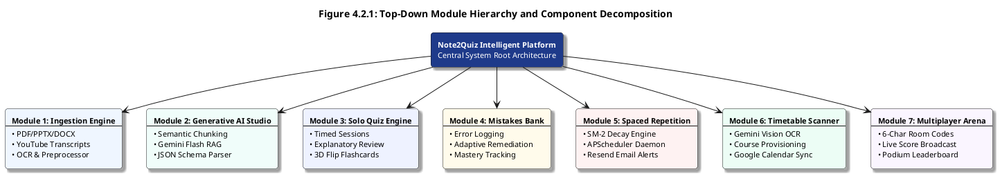

# Figure 4.2.1: Top-Down Module Hierarchy and Component Decomposition - Design & Diagram Prompts

This document provides multi-format diagram specifications (AI Visual Prompts, Mermaid.js, PlantUML, and Thesis Section Context) to generate **Figure 4.2.1: Top-Down Module Hierarchy and Component Decomposition** for Chapter 4 (System Design) of your Final Year Project (FYP2) report.

---

### 1. Content-Focused AI Generation Prompt (Unconstrained & Creative)
*(Feed this directly into **Napkin AI**, **Eraser.io**, **Whimsical AI**, **Claude Artifacts**, **ChatGPT Plus**, **Miro AI**, or **Midjourney** to let their layout engines produce optimal, compact, and aesthetic hierarchy visuals without awkward whitespace)*

```text
Create a high-resolution, modern academic system decomposition and module hierarchy diagram for a university computer science thesis.

Title: Figure 4.2.1: Top-Down Module Hierarchy and Component Decomposition
System Name: Note2Quiz Intelligent Platform (AI-Powered Active Recall & Automated Study Assistant)

Please design a clean, well-proportioned, visually compact top-down functional decomposition tree showing the Central Root breaking down into the following 7 core functional modules and their sub-components:

1. Module 1: Multi-Modal Ingestion Engine
   - Multi-format document parser (PDF, PPTX, DOCX, TXT)
   - YouTube video transcript extractor & synchronizer
   - Camera image OCR text recognition engine
   - Text sanitizer, preprocessor & noise filter

2. Module 2: Generative AI Studio Engine
   - Semantic RAG text chunking & keyword density analyzer
   - Google Gemini 1.5 Flash / 2.0 prompt orchestrator
   - Automatic quiz, flashcard & mind map generator
   - Strict JSON schema validator & retry handler

3. Module 3: Interactive Solo Quiz Engine
   - Timed multiple-choice testing session engine
   - Dynamic option shuffling & anti-bias randomization
   - Immediate scoring & performance analytics
   - Comprehensive AI explanatory review & feedback
   - 3D interactive flip flashcard deck

4. Module 4: Mistakes Bank & Remediation Engine
   - Cross-notebook error logging & misconception aggregator
   - Dynamic weakness diagnostic & concept mastery tracking
   - Adaptive remedial drill generator targeting past errors
   - Targeted review mode for failed concepts

5. Module 5: Spaced Repetition Automation Engine
   - SuperMemo-2 (SM-2) memory stability algorithm
   - Ebbinghaus forgetting-curve retention decay model
   - Asynchronous APScheduler cron daemon worker
   - Transactional revision emails with deep-link triggers (Resend API)

6. Module 6: Timetable & Syllabus Scanner
   - Gemini Vision schedule table OCR & extractor
   - Automated semester course notebook provisioner
   - Bidirectional Google Calendar API event synchronizer
   - Standard RFC 5545 (.ics) iCalendar exporter

7. Module 7: Real-Time Live Multiplayer Quiz Arena
   - Ephemeral 6-character room code generator
   - In-memory active game state & participant synchronization
   - Live real-time scoreboard & podium leaderboard
   - Interactive Kahoot-style host/player interface

Design Preferences:
- Modern, clean, balanced proportions with zero excessive whitespace.
- Cohesive color coding for the 7 modules with distinct accents.
- Professional typography, high readability, publication quality.
```

---

## 2. AI Visual Generation Prompt
*(Copy-paste this directly into **Eraser.io**, **Napkin AI**, **Claude Artifacts**, **ChatGPT Plus**, **Midjourney v6**, or **DALL-E 3**)*

```text
Generate a clean, modern, publication-ready academic software engineering module hierarchy diagram titled "Figure 4.2.1: Top-Down Module Hierarchy and Component Decomposition" for a university computer science thesis.

Structure & Layout (Top-Down Tree Decomposition):

[ROOT NODE] (Top Center, Deep Navy #1E3A8A)
- Title: "Note2Quiz Intelligent Platform"
- Subtitle: "Central System Root Architecture (Client-Server Modular Decomposition)"
- A solid vertical line connects downward into a horizontal organizational distribution bus.

[SEVEN CORE FUNCTIONAL SUBSYSTEMS] (Evenly distributed horizontally across 7 distinct color-coded modular cards):

1. [Module 1: Multi-Modal Ingestion Engine] (Royal Blue #1E3A8A / #EFF6FF)
   - Header: "Module 1: Multi-Modal Ingestion Engine"
   - Sub-Components: PDF / PPTX Parser, DOCX & TXT Reader, YouTube Transcripts Sync, Image OCR Engine, Text Preprocessor, File Sanitizer.

2. [Module 2: Generative AI Studio Engine] (Ocean Teal #0D5E7A / #F0FDFA)
   - Header: "Module 2: Generative AI Studio Engine"
   - Sub-Components: Semantic Chunking, RAG Prompt Builder, Gemini 1.5 Flash API, JSON Schema Parser, Mind Map Synthesizer, Flashcard Generator.

3. [Module 3: Interactive Solo Quiz Engine] (Indigo #3730A3 / #EEF2FF)
   - Header: "Module 3: Interactive Solo Quiz Engine"
   - Sub-Components: Timed Quiz Sessions, Option Shuffling, Dynamic Scoring, Explanatory Review, 3D Flip Flashcards, Progress Summary.

4. [Module 4: Mistakes Bank & Remediation] (Warm Amber / Rust #9A3412 / #FFFBEB)
   - Header: "Module 4: Mistakes Bank & Remediation"
   - Sub-Components: Cross-Quiz Error Log, Mistake Aggregator, Adaptive Drill Gen, Concept Mastery Bar, Targeted Quizzing, Remedial Analytics.

5. [Module 5: Spaced Repetition Automation] (Crimson Red #7C2D12 / #FEF2F2)
   - Header: "Module 5: Spaced Repetition Automation"
   - Sub-Components: SM-2 Stability Engine, Ebbinghaus Decay, APScheduler Daemon, Resend Email Alerts, Deep-Link Triggers, Revision Roadmap.

6. [Module 6: Timetable & Syllabus Scanner] (Emerald Green #065F46 / #ECFDF5)
   - Header: "Module 6: Timetable & Syllabus Scanner"
   - Sub-Components: Gemini Vision OCR, Course Provisioner, Google Calendar Sync, RFC 5545 .ics Export, Slot & Room Parser, Schedule Reminders.

7. [Module 7: Real-Time Live Multiplayer Arena] (Purple #581C87 / #FAF5FF)
   - Header: "Module 7: Real-Time Live Multiplayer Arena"
   - Sub-Components: 6-Char Room Codes, Active Room State, Live Score Broadcast, Podium Leaderboard, Kahoot-Style UI, Host Pin & Controls.

[BOTTOM SUMMARY FOOTER]
- Architectural Cohesion & Loose Coupling Design Principles: High cohesion within modules; loose coupling via RESTful contracts and asynchronous schedulers.

Aesthetic Style:
- Clean modular tree hierarchy with crisp perpendicular bus connectors.
- Rounded rectangular cards with colored header pills and white inner sub-component boxes.
- Pure white background (#FFFFFF), modern sans-serif font, academic publication aesthetic.
```

---

## 3. Professional Mermaid.js Code
> *Paste directly into [Mermaid Live Editor (mermaid.live)](https://mermaid.live), GitHub, Notion, or Obsidian.*

```mermaid
%%{init: {'theme': 'base', 'themeVariables': { 'fontFamily': 'Arial, sans-serif' }}}%%
graph TD
    Root["<b>Note2Quiz Intelligent Platform</b><br/>Central System Root Architecture"]

    subgraph Modules ["Seven Decoupled Functional Subsystems"]
        direction LR
        M1["<b>Module 1: Multi-Modal Ingestion</b><br/>• PDF / PPTX Parser<br/>• DOCX & TXT Reader<br/>• YouTube Transcripts<br/>• Image OCR Engine<br/>• Text Preprocessor"]
        M2["<b>Module 2: Generative AI Studio</b><br/>• Semantic Chunking<br/>• RAG Prompt Builder<br/>• Gemini 1.5 Flash API<br/>• JSON Schema Parser<br/>• Mind Map Synthesizer"]
        M3["<b>Module 3: Interactive Solo Quiz</b><br/>• Timed Quiz Sessions<br/>• Option Shuffling<br/>• Dynamic Scoring<br/>• Explanatory Review<br/>• 3D Flip Flashcards"]
        M4["<b>Module 4: Mistakes Bank</b><br/>• Cross-Quiz Error Log<br/>• Mistake Aggregator<br/>• Adaptive Drill Gen<br/>• Concept Mastery Bar<br/>• Targeted Quizzing"]
        M5["<b>Module 5: Spaced Repetition</b><br/>• SM-2 Stability Engine<br/>• Ebbinghaus Decay<br/>• APScheduler Daemon<br/>• Resend Email Alerts<br/>• Deep-Link Triggers"]
        M6["<b>Module 6: Timetable Scanner</b><br/>• Gemini Vision OCR<br/>• Course Provisioner<br/>• Google Calendar Sync<br/>• RFC 5545 .ics Export<br/>• Slot & Room Parser"]
        M7["<b>Module 7: Multiplayer Arena</b><br/>• 6-Char Room Codes<br/>• Active Room State<br/>• Live Score Broadcast<br/>• Podium Leaderboard<br/>• Kahoot-Style UI"]
    end

    Root --> M1
    Root --> M2
    Root --> M3
    Root --> M4
    Root --> M5
    Root --> M6
    Root --> M7

    style Root fill:#1E3A8A,stroke:#1D4ED8,stroke-width:2px,color:#FFFFFF,rx:8px,ry:8px
    style M1 fill:#EFF6FF,stroke:#2563EB,stroke-width:2px,rx:6px,ry:6px
    style M2 fill:#F0FDFA,stroke:#0D9488,stroke-width:2px,rx:6px,ry:6px
    style M3 fill:#EEF2FF,stroke:#6366F1,stroke-width:2px,rx:6px,ry:6px
    style M4 fill:#FFFBEB,stroke:#EA580C,stroke-width:2px,rx:6px,ry:6px
    style M5 fill:#FEF2F2,stroke:#DC2626,stroke-width:2px,rx:6px,ry:6px
    style M6 fill:#ECFDF5,stroke:#059669,stroke-width:2px,rx:6px,ry:6px
    style M7 fill:#FAF5FF,stroke:#9333EA,stroke-width:2px,rx:6px,ry:6px
    linkStyle 0,1,2,3,4,5,6 stroke:#2563EB,stroke-width:2px
```



---

## 3. PlantUML Architecture Tree Code
> *Paste into [PlantText (planttext.com)](https://www.planttext.com/)*



---

## 4. Formal Thesis Caption & Description (Chapter 4, Section 4.2)

**Figure 4.2.1: Top-Down Module Hierarchy and Component Decomposition**  
*Figure 4.2.1 illustrates the structural decomposition of the Note2Quiz platform into seven decoupled, highly cohesive functional modules. Guided by principles of separation of concerns and loose coupling, the root system branches into dedicated engines for Multi-Modal Document Ingestion, Generative AI Orchestration, Interactive Solo Quizzing, Mistakes Capture & Remediation, Spaced Repetition Automation, Timetable & Syllabus Scanning, and Real-Time Multiplayer Quiz Arena. Each module encapsulates its internal computational routines while exposing clean RESTful interfaces and asynchronous events.*
