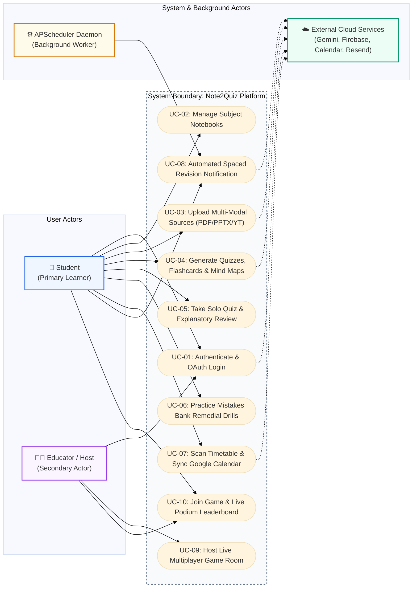
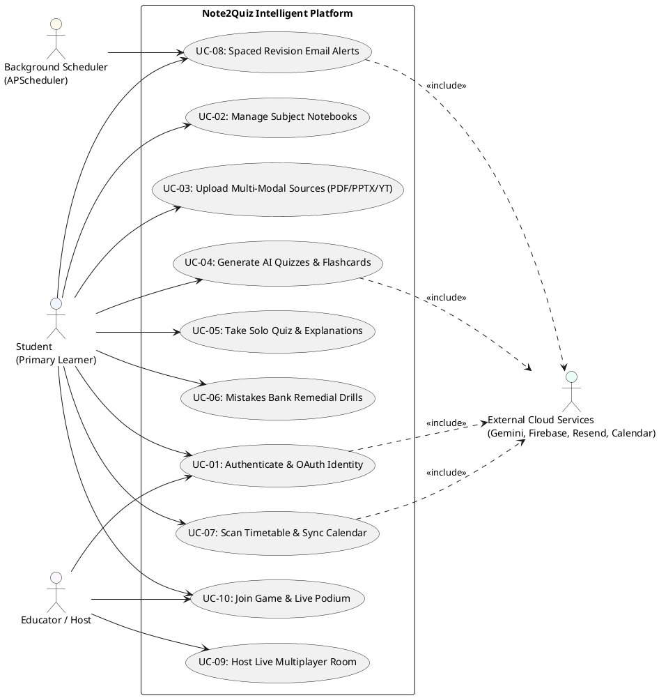

# Figure 4.3.1: Comprehensive System Use Case Diagram - Specifications & Prompts

This document provides multi-format specifications (Content-Driven AI Prompts, Mermaid.js, PlantUML, and Thesis Context) for **Figure 4.3.1: Comprehensive System Use Case Diagram** in Chapter 4 of the FYP2 report.

---

## 1. Content-Focused AI Generation Prompt (Unconstrained & Creative)
*(Feed directly into **Napkin AI**, **Eraser.io**, **Whimsical AI**, **Claude Artifacts**, **ChatGPT Plus**, **Miro AI**, or **Midjourney**)*

```text
Create a clean, professional, publication-ready UML Use Case diagram for a university computer science thesis.

Title: Figure 4.3.1: Comprehensive System Use Case Diagram
System Boundary: Note2Quiz Intelligent Platform (AI-Powered Active Recall & Automated Study Assistant)

Actors (Left & Right of System Boundary):
1. Primary User Actors:
   - Student (Primary Learner)
   - Educator / Room Host (Secondary User)
2. System & Automated Actors:
   - External Cloud Services (Google Gemini AI, Firebase Auth, Google Calendar, Resend API)
   - Background Scheduler Worker (APScheduler Daemon)

Core Use Cases inside System Boundary:
[Authentication & User Profile]
- UC-01: Authenticate & Manage Profile (Student, Host -> Firebase Auth)
- UC-02: Track Daily Study Streak & XP Gamification (Student)

[Notebooks & Multi-Modal Ingestion]
- UC-03: Create & Organize Subject Notebooks (Student)
- UC-04: Upload Lecture Sources (PDF, PPTX, DOCX, TXT, YouTube, Camera OCR) (Student -> Ingestion Engine)

[Generative AI Studio]
- UC-05: Generate Interactive Solo Quiz (Student -> Gemini Flash LLM)
- UC-06: Generate 3D Flip Flashcard Decks (Student -> Gemini Flash LLM)
- UC-07: Synthesize Interactive Visual Mind Maps (Student -> Gemini Flash LLM)

[Self-Assessment & Remediation]
- UC-08: Take Solo Quiz & Review Deep Explanations (Student)
- UC-09: Capture Errors & Practice Mistakes Bank Remedial Drills (Student)

[Automations & Timetables]
- UC-10: Scan & Parse Semester Timetable Image (Student -> Gemini Vision OCR)
- UC-11: Sync Syllabus Schedule with Google Calendar & Export .ics (Student -> Google Calendar API)
- UC-12: Dispatch Dual-Trigger Spaced Revision Emails (Background Scheduler -> Resend API -> Student)
- UC-13: Deep-Link Direct Revision Completion (Student)

[Real-Time Multiplayer Arena]
- UC-14: Host Live Classroom Quiz Game Room (Educator / Host)
- UC-15: Join Game Room with 6-Char Pin & Select Avatar (Student)
- UC-16: Live Synchronous Question Broadcast & Podium Leaderboard (Host, Student)

Design Preferences:
- High readability, balanced compact layout without excessive whitespace.
- Clean standard UML oval use cases grouped logically with subtle dashed package boundaries.
- Clean association lines connecting actors to relevant use cases.
- Professional academic aesthetic on pure white background (#FFFFFF).
```

---

## 2. Professional Mermaid.js Code
> *Paste directly into [Mermaid Live Editor (mermaid.live)](https://mermaid.live), GitHub, Notion, or Obsidian.*



---

## 3. PlantUML Use Case Code
> *Paste into [PlantText (planttext.com)](https://www.planttext.com/)*



---

## 4. Formal Thesis Caption (Chapter 4, Section 4.3)
**Figure 4.3.1: Comprehensive System Use Case Diagram**  
*Figure 4.3.1 depicts the comprehensive UML Use Case diagram for the Note2Quiz platform. It defines the operational boundaries and interactions between primary human actors (Student, Educator/Host) and automated system actors (APScheduler Daemon, Google Cloud / Firebase / Resend APIs) across account authentication, multi-modal content ingestion, Generative AI studio synthesis, adaptive mistake remediation, automated spaced retention triggers, and live multiplayer synchronization.*
