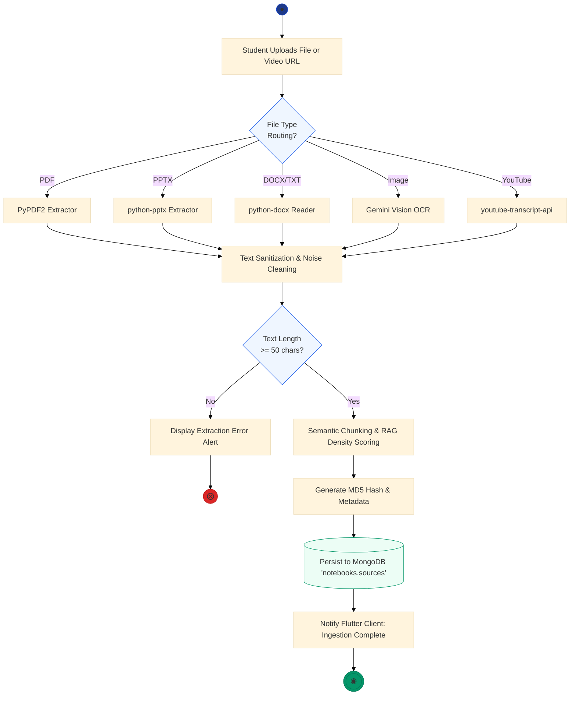
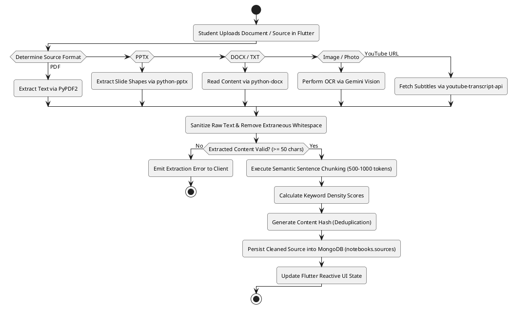

# Figure 4.4.1: Multi-Modal Document Ingestion and Semantic RAG Activity Diagram - Specifications & Prompts

This document provides multi-format specifications (Content-Driven AI Prompts, Mermaid.js, PlantUML, and Thesis Context) for **Figure 4.4.1: Multi-Modal Document Ingestion and Semantic RAG Activity Diagram** in Chapter 4 of the FYP2 report.

---

## 1. Content-Focused AI Generation Prompt (Unconstrained & Creative)
*(Feed directly into **Napkin AI**, **Eraser.io**, **Whimsical AI**, **Claude Artifacts**, **ChatGPT Plus**, **Miro AI**, or **Midjourney**)*

```text
Create a high-resolution, modern academic UML Activity / Flow diagram for a university computer science thesis.

Title: Figure 4.4.1: Multi-Modal Document Ingestion and Semantic RAG Activity Diagram
System: Note2Quiz Multi-Modal Pipeline

Workflow Description (Swimlanes or Pipeline Steps):
1. Start Node: Student initiates document upload in Flutter Client.
2. File Format Decision Gateway:
   - If PDF Document -> Route to PyPDF2 Text & Layout Extractor
   - If PowerPoint (.pptx) -> Route to python-pptx Slide Shape Extractor
   - If Word (.docx) / TXT -> Route to python-docx Document Reader
   - If Image (.png / .jpg) -> Route to Google Gemini Vision OCR Pipeline
   - If YouTube Video URL -> Query youtube-transcript-api for Timed Captions
3. Merge & Sanitization:
   - Clean Unicode symbols, remove extraneous whitespace, filter noise & page numbers.
4. Validation Decision Gateway:
   - Check if extracted character count >= minimum threshold (e.g. > 50 characters).
   - If Invalid -> Display Error Notification to User -> Terminate Flow.
   - If Valid -> Proceed to Processing.
5. Semantic Processing Pipeline:
   - Semantic Sentence Chunking (token-bounded chunks of 500-1000 tokens with 10% overlap).
   - Compute Term Frequency & Keyword Density Scores.
   - Generate Document MD5 Content Hash (for deduplication).
6. Persistence & State Update:
   - Save parsed content into MongoDB `notebooks.sources` array.
   - Update Client Notebook Ingestion State & Refresh Available Tokens.
7. End Node: Document ready for AI Studio item generation.

Design Preferences:
- High readability, balanced compact layout without excessive whitespace.
- Clean standard UML Activity diagram elements: Rounded action states, decision diamonds, horizontal fork/join synchronization bars.
- Clear error branch with graceful exit.
- Modern academic color palette (Ocean Teal / Navy Blue / Emerald Green) on pure white background (#FFFFFF).
```

---

## 2. Professional Mermaid.js Code
> *Paste directly into [Mermaid Live Editor (mermaid.live)](https://mermaid.live), GitHub, Notion, or Obsidian.*



---

## 3. PlantUML Activity Diagram Code
> *Paste into [PlantText (planttext.com)](https://www.planttext.com/)*



---

## 4. Formal Thesis Caption (Chapter 4, Section 4.4.1)
**Figure 4.4.1: Multi-Modal Document Ingestion and Semantic RAG Activity Diagram**  
*Figure 4.4.1 details the activity workflow executed during multi-modal document ingestion. Incoming lecture sources are categorized by MIME type and routed through dedicated extractors (PyPDF2, python-pptx, python-docx, Gemini Vision OCR, and YouTube transcript API). The raw payload undergoes text sanitization and threshold validation before semantic chunking and term-frequency scoring are applied. The structured source metadata is then committed to MongoDB, completing the preprocessing pipeline for subsequent RAG generative inference.*
