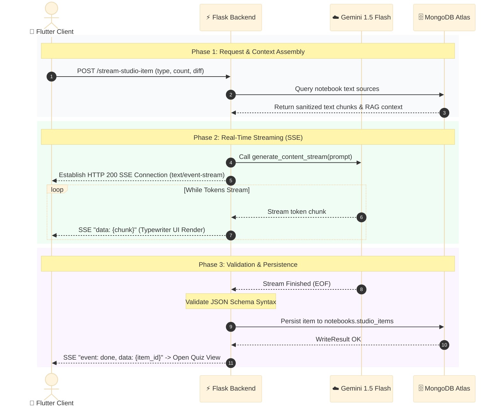
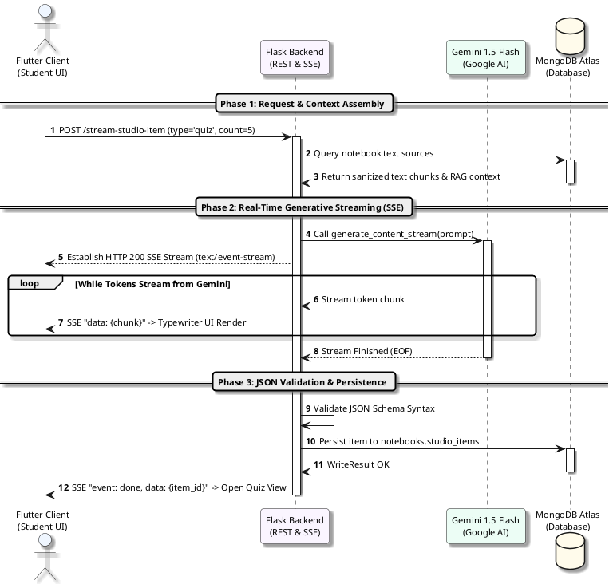

# Figure 4.4.2: Real-Time AI Studio Generation and SSE Streaming Sequence Diagram - Specifications & Prompts

This document provides multi-format specifications (Content-Driven AI Prompts, Mermaid.js, PlantUML, and Thesis Context) for **Figure 4.4.2: Real-Time AI Studio Generation and SSE Streaming Sequence Diagram** in Chapter 4 of the FYP2 report.

---

## 1. Lecturer-Friendly Content-Focused AI Generation Prompt (Clean & Minimalist)
*(Feed directly into **Napkin AI**, **Eraser.io**, **Whimsical AI**, **Claude Artifacts**, **ChatGPT Plus**, or **Miro AI**)*

```text
Create a clean, uncluttered, publication-ready UML Sequence Diagram for a university computer science thesis.
Title: Figure 4.4.2: Real-Time AI Studio Generation and SSE Streaming Sequence Diagram

Please use exactly 4 clear participants (from left to right):
1. Flutter Client (Student UI)
2. Flask Backend (REST & SSE Router)
3. Google Gemini 1.5 Flash (Cloud Generative AI)
4. MongoDB Atlas (Document Database)

Structure the sequence into 3 distinct, color-coded phases:

[PHASE 1: Request & Context Assembly]
1. Flutter Client -> Flask Backend: POST /stream-studio-item (type='quiz', diff='medium', count=5)
2. Flask Backend -> MongoDB Atlas: Query notebook text sources
3. MongoDB Atlas --> Flask Backend: Return sanitized text chunks & RAG context

[PHASE 2: Real-Time Token Streaming (Server-Sent Events / SSE)]
4. Flask Backend -> Google Gemini 1.5 Flash: Call generate_content_stream(prompt)
5. Flask Backend --> Flutter Client: Establish HTTP 200 SSE Connection (text/event-stream)
Loop [While Tokens Stream from Gemini]:
  6a. Google Gemini 1.5 Flash --> Flask Backend: Stream token chunk
  6b. Flask Backend --> Flutter Client: SSE "data: {chunk}" -> Typewriter UI animation

[PHASE 3: JSON Schema Validation & Persistence]
7. Google Gemini 1.5 Flash --> Flask Backend: Stream Finished (EOF)
8. Flask Backend: Validate JSON Schema Syntax & Completeness (self-call)
9. Flask Backend -> MongoDB Atlas: Persist item to notebooks.studio_items
10. Flask Backend --> Flutter Client: SSE "event: done, data: {item_id}" -> Launch Interactive Quiz

Design Requirements:
- Maximum clarity for academic examiners: Do not crowd with internal sub-services.
- No detached floating numbers or cluttered left margins.
- Message descriptions placed directly on arrow lines.
- Pure white background (#FFFFFF) with high contrast.
```

---

## 2. Professional Mermaid.js Code
> *Paste directly into [Mermaid Live Editor (mermaid.live)](https://mermaid.live), GitHub, Notion, or Obsidian.*



---

## 3. PlantUML Sequence Diagram Code
> *Paste into [PlantText (planttext.com)](https://www.planttext.com/)*



---

## 4. Formal Thesis Caption (Chapter 4, Section 4.4.2)
**Figure 4.4.2: Real-Time AI Studio Generation and SSE Streaming Sequence Diagram**  
*Figure 4.4.2 details the sequence flow for low-latency Generative AI study material generation. The workflow is organized into three distinct phases: Phase 1 gathers and sanitizes notebook text sources for RAG prompt construction; Phase 2 establishes a Server-Sent Events (SSE) stream relaying Gemini 1.5 Flash token chunks to the Flutter client in real time; Phase 3 validates the completed JSON payload against strict schema rules, persists the verified study item into MongoDB, and notifies the client to render the interactive quiz interface.*
