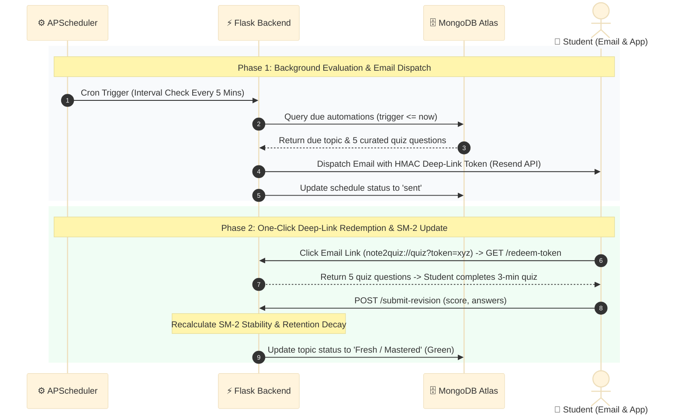
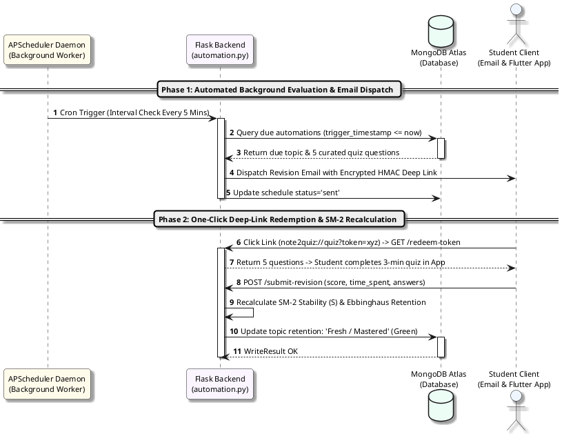

# Figure 4.4.3: Dual-Trigger Automated Spaced Revision Notification Sequence Diagram - Specifications & Prompts

This document provides multi-format specifications (Content-Driven AI Prompts, Mermaid.js, PlantUML, and Thesis Context) for **Figure 4.4.3: Dual-Trigger Automated Spaced Revision Notification Sequence Diagram** in Chapter 4 of the FYP2 report.

---

## 1. Lecturer-Friendly Content-Focused AI Generation Prompt (Clean & Minimalist)
*(Feed directly into **Napkin AI**, **Eraser.io**, **Whimsical AI**, **Claude Artifacts**, **ChatGPT Plus**, or **Miro AI**)*

```text
Create a clean, uncluttered, publication-ready UML Sequence Diagram for a university computer science thesis.
Title: Figure 4.4.3: Dual-Trigger Automated Spaced Revision Notification Sequence Diagram

Please use exactly 4 clear participants (from left to right):
1. APScheduler Daemon (Background Worker)
2. Flask Backend (automation.py)
3. MongoDB Atlas (automations & quiz)
4. Student Client (Email & Flutter App)

Structure the sequence into 2 distinct, color-coded phases:

[PHASE 1: Automated Background Schedule Evaluation & Email Dispatch]
1. APScheduler Daemon -> Flask Backend: Cron Trigger (Interval Check Every 5 Mins)
2. Flask Backend -> MongoDB Atlas: Query due automations (trigger_timestamp <= now)
3. MongoDB Atlas --> Flask Backend: Return due topic & 5 curated quiz questions
4. Flask Backend -> Student Client: Dispatch Revision Email via Resend API (Encrypted HMAC Deep-Link Token)
5. Flask Backend -> MongoDB Atlas: Update schedule status: 'sent', sent_at: ISODate()

[PHASE 2: One-Click Deep-Link Redemption & SM-2 Memory Recalculation]
6. Student Client -> Flask Backend: Student clicks email link (note2quiz://quiz?token=xyz) -> GET /redeem-token
7. Flask Backend --> Student Client: Return 5 quiz questions -> Student completes 3-min quiz directly in App
8. Student Client -> Flask Backend: POST /submit-revision (score, time_spent, answers)
9. Flask Backend: Recalculate SM-2 Stability (S) & Ebbinghaus Retention (self-call)
10. Flask Backend -> MongoDB Atlas: Update topic retention: 'Fresh / Mastered' (Green)

Design Requirements:
- Maximum clarity for academic examiners: 4 clear lifelines without overcrowding.
- No floating numbers or messy left margins.
- Clean return arrows (dashed lines) for data responses.
- Pure white background (#FFFFFF) with high contrast.
```

---

## 2. Professional Mermaid.js Code
> *Paste directly into [Mermaid Live Editor (mermaid.live)](https://mermaid.live), GitHub, Notion, or Obsidian.*



---

## 3. PlantUML Sequence Diagram Code
> *Paste into [PlantText (planttext.com)](https://www.planttext.com/)*



---

## 4. Formal Thesis Caption (Chapter 4, Section 4.4.3)
**Figure 4.4.3: Dual-Trigger Automated Spaced Revision Notification Sequence Diagram**  
*Figure 4.4.3 details the dual-phase operational lifecycle of automated spaced revision reminders. In Phase 1, the APScheduler background daemon periodically evaluates MongoDB for pending syllabus triggers and dispatches contextual HTML emails with secure HMAC deep links via the Resend API. In Phase 2, the student executes zero-friction revision by launching directly into the quiz from their email client, with the backend dynamically recalculating SM-2 memory stability parameters upon completion.*
