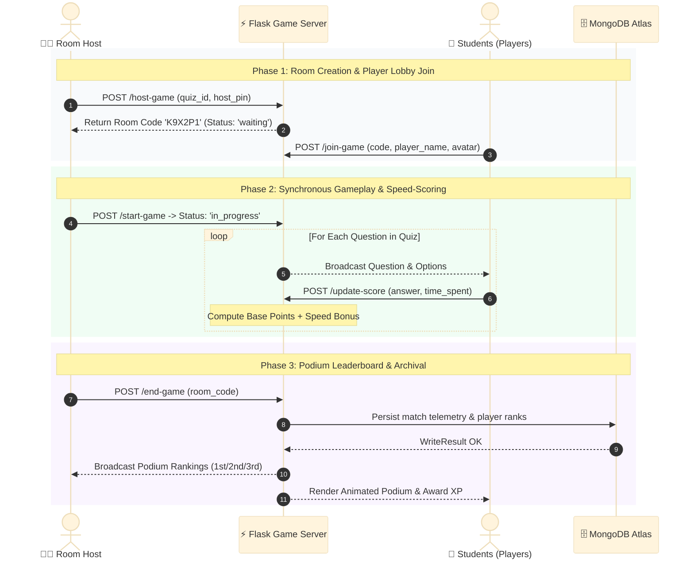
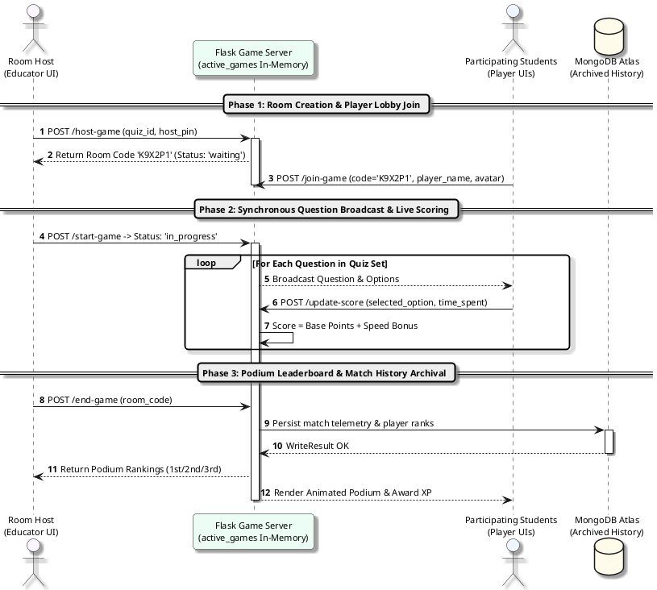

# Figure 4.4.4: Real-Time Multiplayer Quiz Arena Lifecycle Sequence Diagram - Specifications & Prompts

This document provides multi-format specifications (Content-Driven AI Prompts, Mermaid.js, PlantUML, and Thesis Context) for **Figure 4.4.4: Real-Time Multiplayer Quiz Arena Lifecycle Sequence Diagram** in Chapter 4 of the FYP2 report.

---

## 1. Lecturer-Friendly Content-Focused AI Generation Prompt (Clean & Minimalist)
*(Feed directly into **Napkin AI**, **Eraser.io**, **Whimsical AI**, **Claude Artifacts**, **ChatGPT Plus**, or **Miro AI**)*

```text
Create a clean, uncluttered, publication-ready UML Sequence Diagram for a university computer science thesis.
Title: Figure 4.4.4: Real-Time Multiplayer Quiz Arena Lifecycle Sequence Diagram

Please use exactly 4 clear participants (from left to right):
1. Room Host (Educator UI)
2. Flask Game Server (active_games In-Memory State)
3. Participating Students (Player UIs)
4. MongoDB Atlas (Archived Match History)

Structure the sequence into 3 distinct, color-coded phases:

[PHASE 1: Room Creation & Player Lobby Join]
1. Room Host -> Flask Game Server: POST /host-game (quiz_id, host_pin)
2. Flask Game Server --> Room Host: Return Room Code: 'K9X2P1' (Status: 'waiting')
3. Participating Students -> Flask Game Server: POST /join-game (code='K9X2P1', player_name, avatar)

[PHASE 2: Synchronous Question Broadcast & Live Speed-Scoring Loop]
4. Room Host -> Flask Game Server: POST /start-game -> Status: 'in_progress'
Loop [For Each Question in Quiz Set]:
  5a. Flask Game Server --> Participating Students: Broadcast Question & Options to Players
  5b. Participating Students -> Flask Game Server: POST /update-score (selected_option, time_spent)
  5c. Flask Game Server: Score = Base Points + Speed Bonus (self-call)

[PHASE 3: Podium Leaderboard & Match History Archival]
6. Room Host -> Flask Game Server: POST /end-game (room_code)
7. Flask Game Server -> MongoDB Atlas: Persist final match telemetry & player ranks
8. Flask Game Server --> Room Host & Participating Students: Return Podium Rankings (1st/2nd/3rd) -> Render Confetti & Award XP

Design Requirements:
- Maximum clarity for academic examiners: 4 clear lifelines without overcrowding.
- No floating detached numbers or messy margins.
- Clean return arrows (dashed lines) for server broadcasts and responses.
- Pure white background (#FFFFFF) with high contrast.
```

---

## 2. Professional Mermaid.js Code
> *Paste directly into [Mermaid Live Editor (mermaid.live)](https://mermaid.live), GitHub, Notion, or Obsidian.*



---

## 3. PlantUML Sequence Diagram Code
> *Paste into [PlantText (planttext.com)](https://www.planttext.com/)*



---

## 4. Formal Thesis Caption (Chapter 4, Section 4.4.4)
**Figure 4.4.4: Real-Time Multiplayer Quiz Arena Lifecycle Sequence Diagram**  
*Figure 4.4.4 illustrates the end-to-end operational sequence of the gamified multiplayer quiz arena. Phase 1 demonstrates room provisioning and 6-character PIN player lobby coordination; Phase 2 highlights the synchronous question broadcast loop and dynamic speed-bonus scoring engine; Phase 3 details match termination, automatic database archival to MongoDB Atlas, and synchronous podium leaderboard rendering with gamification XP disbursement across all participating clients.*
