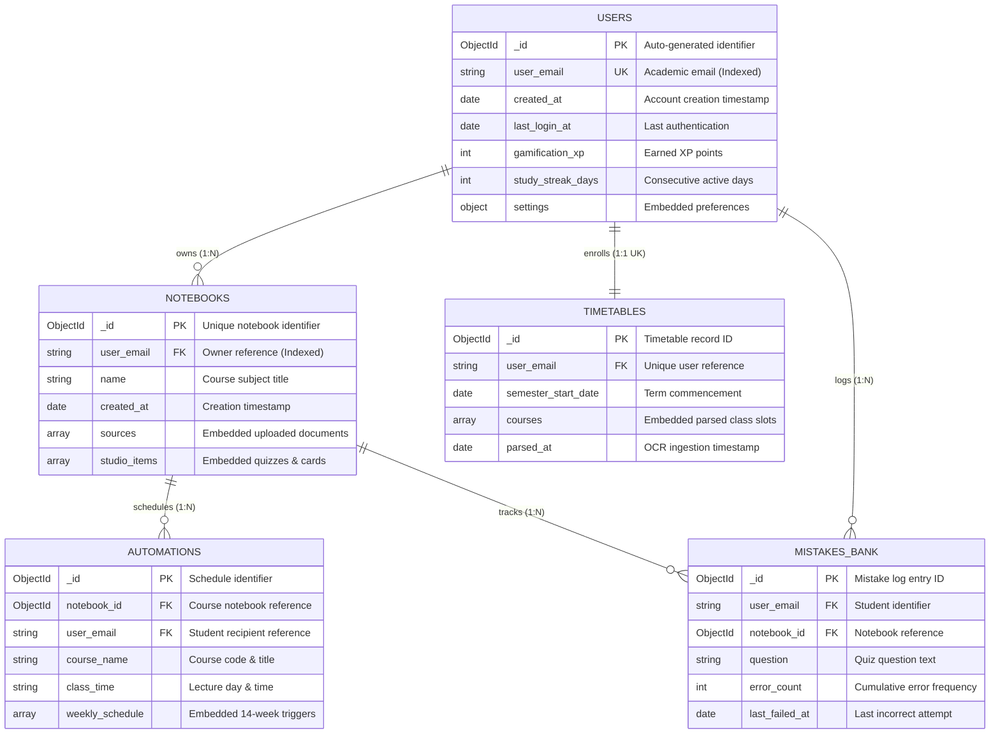

# Figure 4.5.1: Entity-Relationship Model and Document Schema Relationships - Specifications & Prompts

This document provides multi-format specifications (Content-Driven AI Prompts, Mermaid.js, PlantUML, and Thesis Context) for **Figure 4.5.1: Entity-Relationship Model and Document Schema Relationships** in Chapter 4 of the FYP2 report.

---

## 1. Schema Logic Analysis & Error Diagnosis in Earlier Renderings

### ⚠️ Common AI Generator Logic Mistakes:
1. **Floating / Disconnected Entities**:
   - `TIMETABLES` and `STUDY_PLANS` were rendered as isolated boxes with no incoming foreign key relationships.
   - `USERS` has a 1-to-1 unique relationship with `TIMETABLES` (`enrolls: 1:1 UK`), which must be connected.
2. **Misdirected Arrow Lines**:
   - `USERS -> configures` was mistakenly pointing to `NOTEBOOKS` instead of `AUTOMATIONS`.
   - `USERS -> enrolls` was mistakenly pointing to `NOTEBOOKS` instead of `TIMETABLES`.
3. **MongoDB Embedded Sub-Document vs. Referenced Collection Duplication**:
   - `NOTEBOOKS` already embeds `sources` and `studio_items` (quizzes, flashcards) for atomic reads.
   - `MISTAKES_BANK` is a standalone collection indexed by `user_email` and `notebook_id` for system-wide analytics. Having `mistakes` also embedded inside `NOTEBOOKS` was redundant.

---

## 2. Corrected Content-Focused AI Prompt (Logically Precise)
*(Feed directly into **Napkin AI**, **Eraser.io**, **Whimsical AI**, **Claude Artifacts**, or **ChatGPT Plus**)*

```text
Create a clean, publication-ready Entity-Relationship Diagram (ERD) / Document Schema Model for a MongoDB NoSQL database in a university computer science thesis.
Title: Figure 4.5.1: Entity-Relationship Model and Document Schema Relationships
Database: MongoDB Atlas (Note2Quiz Platform)

Entities and Schema Fields:
1. USERS (`users`):
   - PK: _id (ObjectId)
   - UK: user_email (String, Indexed)
   - Fields: created_at, last_login_at, gamification_xp (Int), study_streak_days (Int)
   - Embed: settings (Object)

2. NOTEBOOKS (`notebooks`):
   - PK: _id (ObjectId)
   - FK: user_email (String, Indexed)
   - Fields: name (Course Title), created_at
   - Embed: sources (Array of Objects), studio_items (Array of Objects)

3. AUTOMATIONS (`automations`):
   - PK: _id (ObjectId)
   - FK: notebook_id (ObjectId, Indexed), user_email (String, Indexed)
   - Fields: course_name, class_day / time (HH:MM), semester_start (YYYY-MM-DD)
   - Embed: weekly_schedule (Array of 14-week schedule items)

4. TIMETABLES (`timetables`):
   - PK: _id (ObjectId)
   - FK: user_email (String, UK, Indexed)
   - Fields: semester_start_date, parsed_at
   - Embed: courses (Array of Objects)

5. MISTAKES_BANK (`mistakes_bank`):
   - PK: _id (ObjectId)
   - FK: user_email (String, Indexed), notebook_id (ObjectId, Indexed)
   - Fields: question, options/answer, error_count (Int), last_failed_at

Exact Relationships (Ensure every entity is properly connected with Crow's foot notation):
- USERS (1) ------- owns -------> (N) NOTEBOOKS
- NOTEBOOKS (1) --- schedules --> (N) AUTOMATIONS
- USERS (1) ------- enrolls ----> (1) TIMETABLES (1-to-1 via Unique user_email)
- NOTEBOOKS (1) --- tracks -----> (N) MISTAKES_BANK
- USERS (1) ------- logs -------> (N) MISTAKES_BANK (User activity reference)

Design Requirements:
- Pure white background (#FFFFFF), crisp borders, high contrast.
- Show embedded arrays with distinct green badges (e.g. `Array of Objects (Embed)`).
- Clear Crow's foot cardinality labels (1:1, 1:N). No floating disconnected tables.
```

---

## 3. Professional Mermaid.js Code (100% Valid ERD Syntax)
> *Paste directly into [Mermaid Live Editor (mermaid.live)](https://mermaid.live), GitHub, Notion, or Obsidian.*



---

## 4. Formal Thesis Caption (Chapter 4, Section 4.5.1)
**Figure 4.5.1: Entity-Relationship Model and Document Schema Relationships**  
*Figure 4.5.1 models the hybrid NoSQL BSON schema architecture implemented in MongoDB Atlas. Highly cohesive entities (`sources`, `studio_items`, `weekly_schedule`, `courses`) are embedded directly into parent documents to guarantee atomic single-query reads and zero-join overhead. Conversely, decoupled entities with high write concurrency and growth (`automations`, `mistakes_bank`, `timetables`) utilize normalized indexed references (`user_email`, `notebook_id`) to support multi-notebook analytics and background scheduling queries.*
